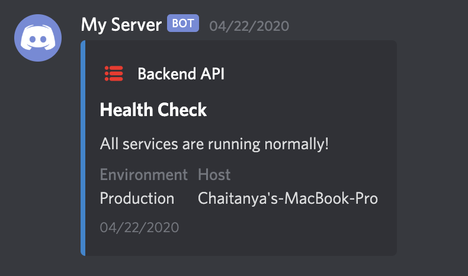
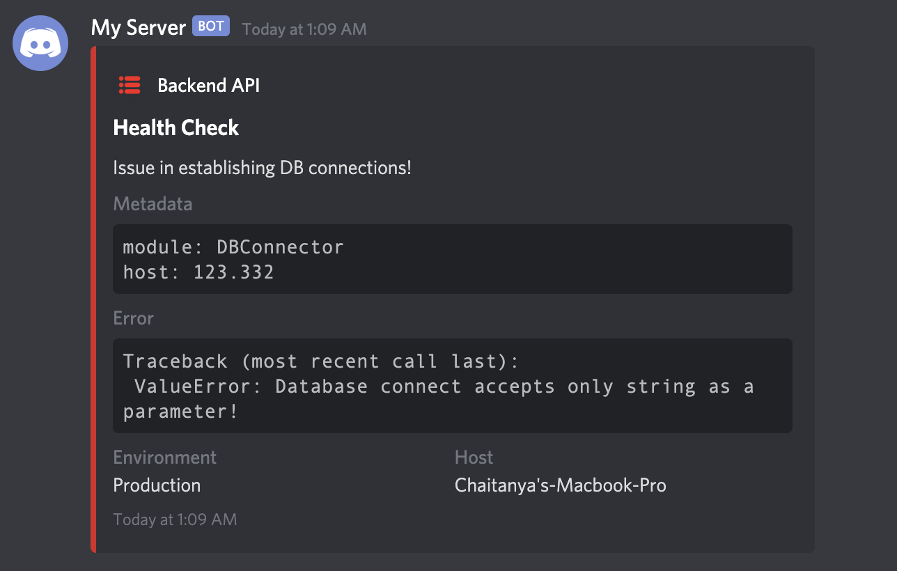
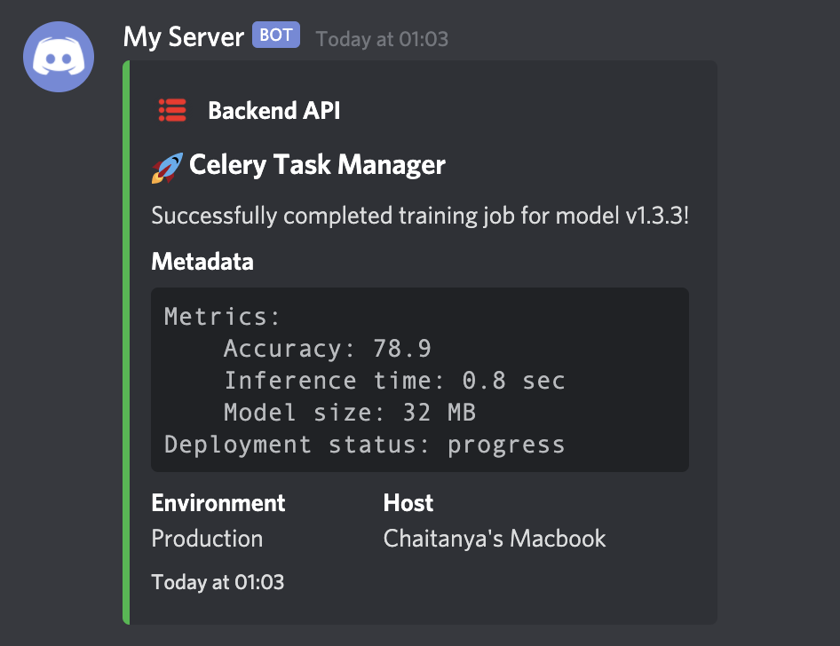
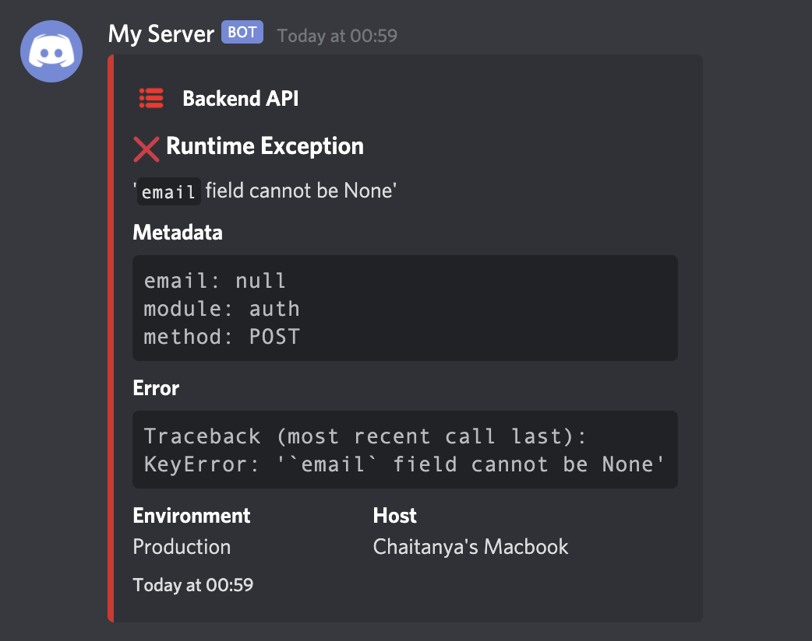

# Python Discord Logger

A custom message logger to Discord for Python 3.
This project was inspired from [`winston-discord-transport`](https://github.com/sidhantpanda/winston-discord-transport) for NodeJS.

<a href="https://img.shields.io/pypi/pyversions/discord-logger"></a>
<a href="https://img.shields.io/pypi/wheel/discord-logger"></a>
<a href="https://static.pepy.tech/badge/discord-logger"></a>
[](https://github.com/chinnichaitanya/python-discord-logger/blob/master/LICENSE)
[](https://github.com/python/black)

## Install

Install via pip: `pip install discord-logger`

## Basic Usage

```python
from discord_logger import DiscordLogger

options = {
    "application_name": "My Server",
    "service_name": "Backend API",
    "service_icon_url": "your icon url",
    "service_environment": "Production",
    "default_level": "info",
}

logger = DiscordLogger(webhook_url="your discord webhook url", **options)
logger.construct(title="Health Check", description="All services are running normally!")

response = logger.send()
```



## Configure various options

There are numerous configurations available to customise the bot.
```python
options = {
    # Application name would replace the webhook name set during creating of the webhook
    # It would appear as the name of the bot
    # If unset, the default value would be "Application"
    "application_name": "My Server",

    # Service name would be the name of the service sending the message to your Discord channel
    # This would usually be the name of the application sending the notification
    # If unset, the default value would be "Status Bot"
    "service_name": "Backend API",

    # Service icon URL is the icon image for your application
    # This field accepts a URL to the icon image
    # If unspecified, the icon wouldn't be set
    # If misconfigured, the icon wouldn't load and a blank space would appear before the service name
    "service_icon_url": "your icon url",

    # Usually services would run in staging and production environments
    # This field is to specify the environment from which the application is reponding for easy identification
    # If unset, this block would not appear in the message
    "service_environment": "Production",

    # The default importance level of the message
    # The left bar color of the message would change depending on this
    # Available options are
    # - default: 2040357
    # - error: 14362664
    # - warn: 16497928
    # - info: 2196944
    # - verbose: 6559689
    # - debug: 2196944
    # - success: 2210373
    # If the `error` field is set during the construction of the message, the `level` is automatically set to `error`
    # If nothing is specified, `default` color would be used
    "default_level": "info",
}
```

## Examples

### Set Service Name, Icon and Environment for easy identification

You can configure the log message with service name, icon and environment for easy identification. The `Host` field which is the hostname of the server is automatically added for every message.

```python
from discord_logger import DiscordLogger

webhook_url = "your discord webhook url"
options = {
    "application_name": "My Server",
    "service_name": "Backend API",
    "service_icon_url": "your icon url",
    "service_environment": "Production",
    "default_level": "info",
}

logger = DiscordLogger(webhook_url=webhook_url, **options)
logger.construct(
    title="Health Check",
    description="Issue in Auth API!",
    error="Traceback (most recent call last):\n ValueError: Database connect accepts only string as a parameter!",
)

response = logger.send()
```



### Send messages with different log-levels

The log-level indicates the importance of the message. It changes the color of the discord message in particular. Currently supported levels are,

- `error`
- `warn`
- `info`
- `verbose`
- `debug`
- `success`

The log-level can be set during construction of the message like through the parameter `level`.

If the parameter isn't provided, it'll be set to the one given in `default_level`. Any invalid input would be ignored and the log-level would be automatically be set to `default`.

```python
from discord_logger import DiscordLogger

options = {
    "application_name": "My Server",
    "service_name": "Backend API",
    "service_icon_url": "your icon url",
    "service_environment": "Production",
    "default_level": "info",
}

logger = DiscordLogger(webhook_url=webhook_url, **options)
logger.construct(
    title="Celery Task Manager",
    description="Successfully completed training job for model v1.3.3!",
    level="success",
)

response = logger.send()
```



- Send complete error traceback

The `error` field can contain any error message. It will be automatically be formatted in the final message. For example, you can send a complete traceback of an error message to debug faster!

```python
import traceback

from discord_logger import DiscordLogger


def get_traceback(e):
    tb = (
        "Traceback (most recent call last):\n"
        + "".join(traceback.format_list(traceback.extract_tb(e.__traceback__)))
        + type(e).__name__
        + ": "
        + str(e)
    )
    return tb


webhook_url = "your discord webhook url"
options = {
    "application_name": "My Server",
    "service_name": "Backend API",
    "service_icon_url": "your icon url",
    "service_environment": "Production",
    "default_level": "info",
}

err = KeyError("`email` field cannot be None")

logger = DiscordLogger(webhook_url=webhook_url, **options)
logger.construct(
    title="Runtime Exception", description=err.__str__(), error=get_traceback(err),
)

response = logger.send()
```


